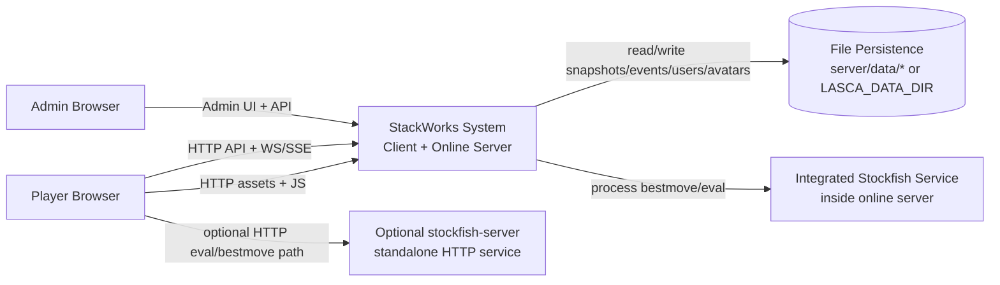

# 02 - Context View

Status: Implemented  
Confidence: High

Related:

- [01-system-overview.md](./01-system-overview.md)
- [03-container-view-current.md](./03-container-view-current.md)
- [08-auth-security-roadmap.md](./08-auth-security-roadmap.md)

## System Context Diagram

## Inside vs Outside Boundary

### Inside System Boundary (Implemented)

- Browser client app pages and shared modules (`src/*`).
- Online server API + realtime + persistence (`server/src/*`).
- Shared domain/contracts consumed by both sides (`src/shared/*`, `src/game/*`).

### Outside System Boundary (Implemented)

- End-user browser runtime.
- Host filesystem/disk used for persistence.
- Deployment host environment variables (for ports, data paths, admin token).

### Outside But Optional Integration (Implemented)

- Standalone stockfish helper service (`stockfish-server/`) used in some local/dev or explicit URL paths.

## External Actors and Systems

### End User Player

- Responsibility: Starts games, joins rooms, plays moves, receives realtime updates.
- Status: Implemented
- Confidence: High
- Key interfaces:
  - Client pages in `src/*.html`
  - Driver logic in `src/driver/*`
- Inputs: UI actions, URL launch parameters.
- Outputs: Move intents, auth/profile actions, room actions.

### Admin Operator

- Responsibility: Use admin UI to inspect/delete rooms.
- Status: Implemented
- Confidence: High
- Key interfaces:
  - `src/admin.html`, `src/adminMain.ts`
  - `DELETE /api/admin/room/:roomId` in `server/src/app.ts`
- Dependencies:
  - `LASCA_ADMIN_TOKEN` configured on server.

### Persistence Storage

- Responsibility: Durable room snapshots/events and auth/profile files.
- Status: Implemented
- Confidence: High
- Key files/folders:
  - `server/src/persistence.ts`
  - `server/src/auth/authStore.ts`
- Inputs: server room/auth mutations.
- Outputs: `.snapshot.json`, `.events.jsonl`, `users.json`, avatar files.

### Optional Stockfish Helper

- Responsibility: Separate local HTTP engine service for move/eval.
- Status: Implemented
- Confidence: High
- Key files/folders:
  - `stockfish-server/server.mjs`
  - `stockfish-server/README.md`
- Inputs: FEN/movetime requests.
- Outputs: bestmove/eval responses.

## Key Interfaces and Protocols

Status: Implemented  
Confidence: High

- HTTP JSON APIs (`/api/*`) between client and online server.
- Realtime:
  - WebSocket: `/api/ws`
  - SSE: `/api/stream/:roomId`
- Snapshot fetch fallback:
  - `GET /api/room/:roomId`
- Auth endpoints:
  - `/api/auth/register`, `/api/auth/login`, `/api/auth/me`, etc.
- Contract files:
  - `src/shared/onlineProtocol.ts`
  - `src/shared/authProtocol.ts`

## Planned/Not Yet Fully Implemented External Integrations

### Broader Product Integrations (clubs/tournaments/community surfaces)

- Status: Planned
- Confidence: Medium
- Evidence:
  - Shell state and play hub include placeholders (`src/config/shellState.ts`, `src/ui/shell/playHub.ts`).
- Unknowns:
  - No dedicated backend services for tournament orchestration are clearly implemented.
- TODO: Confirm target backend interfaces before documenting concrete contracts.

### Production-grade identity/security stack beyond current baseline

- Status: Planned
- Confidence: Medium
- Evidence:
  - Checklist open items in `docs/multiplayer-checklist.md` (MP4/MP6).
- Unknowns:
  - Persistent session store choice and full threat-model controls.
- TODO: Confirm target auth/session architecture.
