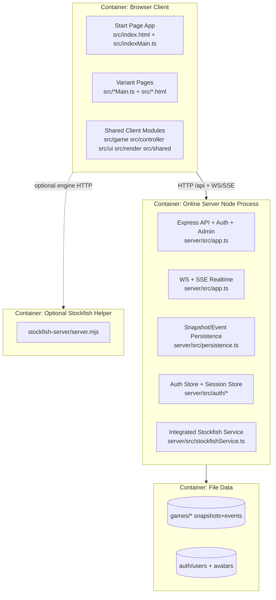

# 03 - Container View (Current)

Status: Implemented  
Confidence: High

Related:

- [02-context-view.md](./02-context-view.md)
- [04-container-view-target.md](./04-container-view-target.md)
- [05-client-architecture-current.md](./05-client-architecture-current.md)
- [07-server-architecture-current.md](./07-server-architecture-current.md)

## Current Container Diagram

## Container Details

### Container: Browser Client (Vite multi-entry)

- Responsibility: User-facing UI, local game runtime, online client transport, launcher/account surfaces.
- Status: Implemented
- Confidence: High
- Technologies:
  - TypeScript + Vite multi-page build.
  - DOM + SVG rendering.
- Startup/request entry points:
  - Build/runtime config: `vite.config.ts`
  - Start page entry: `src/index.html` -> `src/indexMain.ts`
  - Game entries: `src/lasca.html` -> `src/main.ts`, `src/chess.html` -> `src/chessMain.ts`, etc.
- Key files/folders:
  - `src/indexMain.ts`
  - `src/main.ts`, `src/chessMain.ts`, `src/columnsChessMain.ts`, `src/damaMain.ts`, `src/damascaMain.ts`, `src/columnsDraughtsMain.ts`, `src/lasca8x8Main.ts`
  - `src/driver/*`
  - `src/ui/shell/*`
- Inputs:
  - User input, URL query params, localStorage state, server snapshots/events.
- Outputs:
  - API calls, realtime subscriptions, rendered game state/UI.
- Dependencies:
  - Online protocol contracts (`src/shared/onlineProtocol.ts`).
  - Auth protocol/session client (`src/shared/authProtocol.ts`, `src/shared/authSessionClient.ts`).
- Common modification points:
  - Variant-specific `*Main.ts` files and shared controller/driver/ui modules.

### Container: Online Server (Express + WS)

- Responsibility: Authoritative room lifecycle, move validation/apply, realtime broadcast, replay/persistence, auth/profile/avatar, admin endpoints.
- Status: Implemented
- Confidence: High
- Technologies:
  - Node.js, Express, ws, filesystem persistence.
- Startup/request entry points:
  - `server/src/index.ts` -> `startLascaServer(...)` in `server/src/app.ts`
  - HTTP routes declared in `server/src/app.ts`
  - WS attach path: `/api/ws`
  - SSE route: `/api/stream/:roomId`
- Key files/folders:
  - `server/src/app.ts`
  - `server/src/persistence.ts`
  - `server/src/auth/*`
  - `server/src/stockfishService.ts`
- Inputs:
  - HTTP JSON intents, WS messages (JOIN), SSE/HTTP room access reads.
- Outputs:
  - Authoritative snapshots, replay events, auth responses, avatar assets.
- Dependencies:
  - Shared game logic from `src/game/*`.
  - Shared protocol types from `src/shared/*`.
- Common modification points:
  - Route handlers and room mutation helpers in `server/src/app.ts`.

### Container: File-backed Data Stores

- Responsibility: Persist room state and account/profile data.
- Status: Implemented
- Confidence: High
- Technologies:
  - JSON files and append-only JSONL event logs.
- Key files/folders:
  - Room snapshots/events: `server/src/persistence.ts`
  - Auth users: `server/src/auth/authStore.ts`
  - Runtime path config: `render.yaml` (`LASCA_DATA_DIR`)
- Inputs:
  - Room mutation persistence, auth user/profile writes, avatar uploads.
- Outputs:
  - Durable state loaded on restart and used for lobby/rejoin/replay.
- Dependencies:
  - Host disk and path configuration.
- Common modification points:
  - Snapshot/event schema evolution in `server/src/persistence.ts`.

### Container: Optional Standalone Stockfish Helper

- Responsibility: Local HTTP bridge to Stockfish engine when using helper process.
- Status: Implemented
- Confidence: High
- Technologies:
  - Node http server + child-process engine runtime.
- Key files/folders:
  - `stockfish-server/server.mjs`
  - `stockfish-server/README.md`
- Inputs:
  - FEN/movetime requests.
- Outputs:
  - bestmove/eval JSON.
- Dependencies:
  - `stockfish` package engine JS.
- Common modification points:
  - Endpoint behavior in `stockfish-server/server.mjs`.

## How Containers Communicate Today

Status: Implemented  
Confidence: High

- Client -> server control plane: HTTP JSON (`/api/create`, `/api/join`, `/api/submitMove`, etc.).
- Server -> client realtime: WebSocket `snapshot` payloads and SSE `snapshot` events.
- Client fallback sync: `GET /api/room/:roomId` polling/resync path.
- Server persistence: local filesystem writes (`*.snapshot.json`, `*.events.jsonl`, `users.json`).
- Engine options:
  - Main server integrated endpoints: `/api/stockfish/*`.
  - Optional helper service endpoints: `/health`, `/bestmove`.

## CURRENT vs Transitional Notes

### Current stable container edges

- Browser <-> Online server protocols are heavily test-covered and active.
- File-based game persistence is integrated into room lifecycle.

### Transitional container edges

- Legacy UI panel structures coexist with shell surfaces in client runtime.
- Dual engine topology (integrated service and standalone helper) remains available.
- Auth exists but some production-grade controls remain incomplete.
