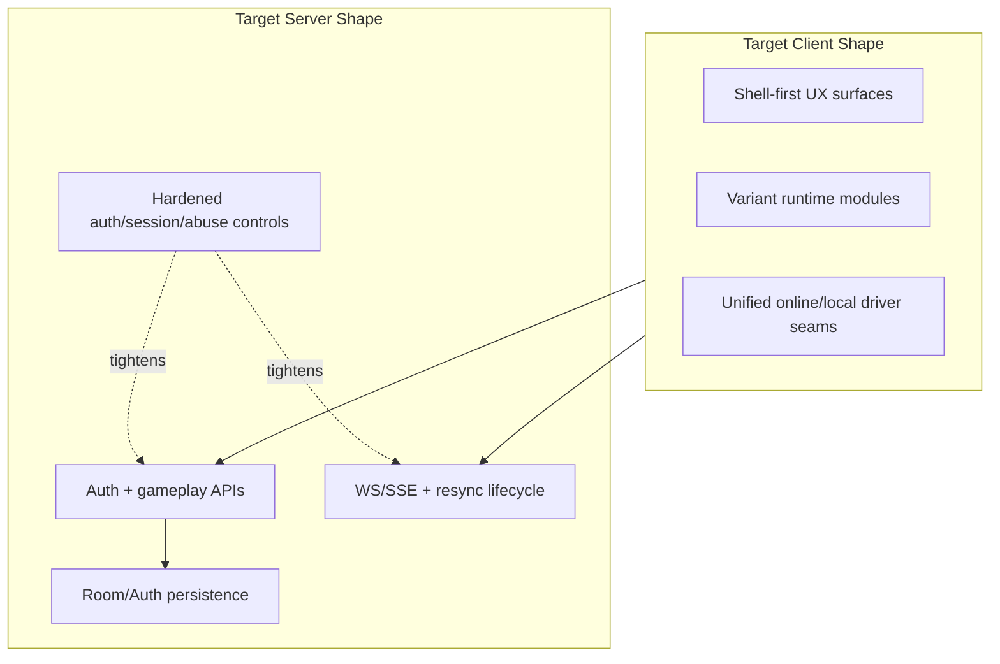

# 04 - Container View (Target / Near-Term)

Status: In Progress  
Confidence: Medium

Related:

- [03-container-view-current.md](./03-container-view-current.md)
- [06-client-architecture-target.md](./06-client-architecture-target.md)
- [08-auth-security-roadmap.md](./08-auth-security-roadmap.md)
- [12-refactor-hotspots.md](./12-refactor-hotspots.md)

## Target Near-Term Diagram (Inferred)

## Target Changes (Reasonably Inferable)

### Shell-First UX Becomes Default

- Responsibility: Remove user-facing dependence on legacy panel structures and converge on shell navigation patterns.
- Status: In Progress
- Confidence: High
- Key files/folders:
  - `docs/refactor-ui-shell.md`
  - `src/ui/shell/gameShell.ts`
  - `src/ui/shell/appShell.ts`
  - `src/ui/shell/playHub.ts`
- Inputs:
  - Existing page content panels, shell state, layout preferences.
- Outputs:
  - Single coherent shell UX per page, reduced duplicate controls.
- Dependencies:
  - Variant pages still remain multi-entry (`vite.config.ts` confirms no SPA migration).
- Common modification points:
  - Shell component files and panel mode controls.

### Auth/Security Maturity Increases

- Responsibility: Move from baseline auth/session support to production-hardened identity and abuse controls.
- Status: Planned
- Confidence: Medium
- Key files/folders:
  - `server/src/app.ts`
  - `server/src/auth/*`
  - `docs/multiplayer-checklist.md`
- Inputs:
  - Session/auth requests and operational policies.
- Outputs:
  - More robust account/session behavior and endpoint protections.
- Dependencies:
  - Existing auth protocol and session client.
- Common modification points:
  - Auth middleware, session store implementation, rate-limiting boundaries.
- Unknowns:
  - Persistent session backend and full account ownership rules are not finalized in code.

### Online Lifecycle Hardening Continues

- Responsibility: Improve reliability under disconnects, reorder, stale intents, and operational edges.
- Status: In Progress
- Confidence: High
- Key files/folders:
  - `src/driver/remoteDriver.ts`
  - `server/src/app.ts`
  - `docs/multiplayer-checklist.md`
- Inputs:
  - Realtime events, reconnect attempts, conflicting requests.
- Outputs:
  - Stable sync behavior and clearer recovery paths.
- Dependencies:
  - Snapshot/stateVersion model in protocol/persistence.
- Common modification points:
  - CAS and room action queue paths, client resync handling.

### Deployment/Ops Hardening

- Responsibility: Improve production operations around persistence, secrets, and observability.
- Status: Planned
- Confidence: Medium
- Key files/folders:
  - `render.yaml`
  - `README.md` deployment section
  - `server/src/app.ts` logging and admin paths
- Inputs:
  - Environment variables and runtime host constraints.
- Outputs:
  - More explicit and safer production operation model.
- Dependencies:
  - Current single-service + disk deployment constraints.
- Common modification points:
  - Deployment manifests and startup/env validation.
- Unknowns:
  - No explicit multi-environment orchestration docs in repo.

## Explicit Speculative/Unknown Areas

- Status: Unknown
- Confidence: Low
- Whether client eventually consolidates to fewer page entry points is not confirmed.
- Whether standalone `stockfish-server/` remains long-term versus integrated-only path is not explicitly decided.
- Whether tournament/club/community features get dedicated backend services is not visible in current server routes.

## Current vs Target Summary

- CURRENT: multi-entry client + authoritative server + file persistence + partial auth hardening.
- TARGET (near-term): shell-first UX completion, stronger auth/security/ops controls, continued online reliability hardening.
- TODO: Validate target assumptions with maintainers before treating as committed architecture.
